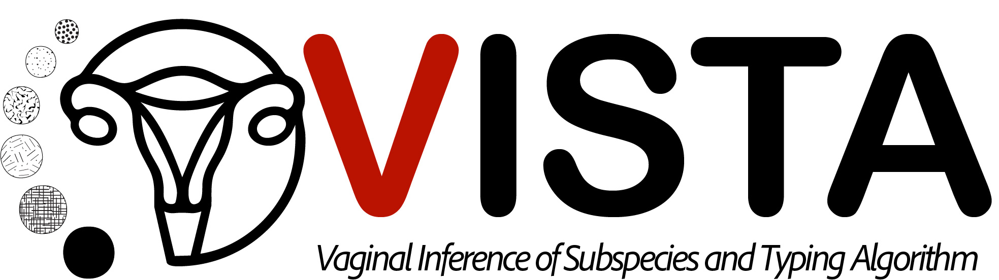

# VISTA: Vaginal Inference of Subspecies and Typing Algorithm

This application provides visualizations and tools for assigning **Metagenomic Community State Types (mgCSTs)** to vaginal metagenomes. It includes a user-friendly interface for running the classifier on **[VIRGO2](https://github.com/ravel-lab/VIRGO2)** compiled output files.

---

## 🛠 Requirements

### Dependencies

This application runs via **Streamlit** and requires both **Python** and **R** environments:

<div align="center">

| Python (v3.8+)         | R (v4.3+)          |
|------------------------|--------------------|
| streamlit              | randomForestSRC    |
| pandas                 | pheatmap           |
| numpy                  | data.table         |
| plotly                 | dplyr              |
| seaborn                | parallel           |
| scipy                  |                    |
| streamlit-pdf-viewer   |                    |

</div>

To install the required Python libraries:

```bash
pip install streamlit pandas numpy plotly seaborn scipy streamlit-pdf-viewer
```

Required R packages are installed automatically via the classifier's R script.

---

### 1. 🔧 Clone the VISTA Repository.
To get started, clone the VISTA repository to your local machine using Git:

    git clone https://github.com/JHolm-Lab/VISTA.git /path/to/destination/VISTA
    cd /path/to/destination/VISTA

This will create a local copy of the VISTA codebase, including the classifier script. Make sure you have Git installed on your system. If not, you can install it from git-scm.com.

### 2. 📥 Download VISTA Resources
To set up the VISTA app and models required for `run_VISTA.R`, download the bundled archive from Figshare:  
**🔗 [VISTA_data.tar.gz](https://figshare.com/ndownloader/files/57767185)**  
version: doi.org/10.6084/m9.figshare.28684934.v8

This includes:  
- VISTA Streamlit app  
- mgSs classification models  
- mgCST reference centroids  

### 3. 🔓 Unpack the Archive

Extract the contents of the archive:

    tar -xzvf /path/to/download_folder/VISTA_data.tar.gz 
    
---

## ⌨️ Classifying mgCSTs with VISTA via Command Line

Run VISTA to assign mgCSTS without launching the Streamlit app.
- The VISTA input file should be a VIRGO2 output file (generated via "VIRGO2.py compile"), provided either as a plain text file or compressed with .gz.
```bash
# Usage:
#   Rscript run_VISTA.R <VIRGO2_compile_summary> <VISTA_data_dir>

Rscript path/to/run_VISTA.R \
  path/to/VIRGO2_output_Compiled.summary.NR.txt \
  /path/to/VISTA

Rscript run_VISTA.R \
  VISTA_example.txt.gz \
  ~/bin/VISTA
```

- Output files are saved to the current working directory.
- Each output file is timestamped.

---
## 💻 Running the VISTA App
The VISTA app allows for exploration of VISTA mgCSTs and mgSs and classification of your own data. 

Launch the VISTA Streamlit interface by navigating to the app directory and running:

```bash
cd path/to/VISTA/VISTA_data
streamlit run 0_Home.py
```

By default, the app allows uploads up to 20MB. To change this limit:

Open the Streamlit configuration file located at:
```bash
cd path/to/VISTA/VISTA_data
.streamlit/config.toml
```

Update or add the following setting:
```bash
[server]
maxUploadSize = 30000  # Set your desired limit in megabytes
```

## Citation
If you use VISTA in your research, please cite:
> [Author(s)]. [Title]. [Journal Name], [Year].

## Documentation and Resources
- VIRGO2 gene catalog: [(https://github.com/ravel-lab/VIRGO2)]
- VISTA publication: [Link if available]
- Web application: Hosted internally

## License
This project is licensed under the MIT License.

## Contact
For questions or contributions, please contact the [JHolm Lab](https://github.com/JHolm-Lab).
